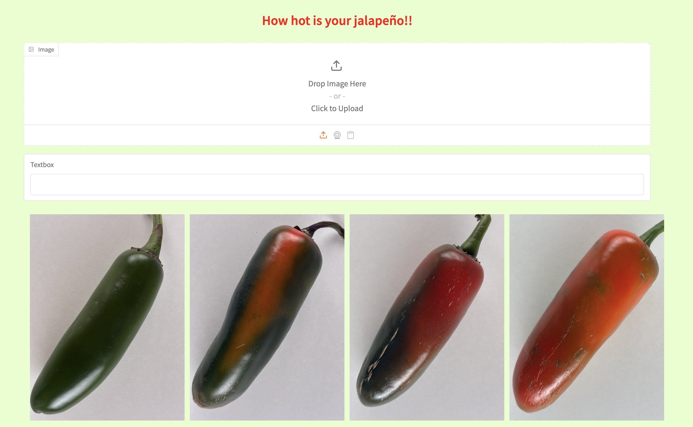

# How hot is your jalapeño!!



A convolutional neural network (CNN) that classifies jalapeño peppers into three heat categories — **hot**, **medium**, or **mild** — from a single photo. Upload an image of your jalapeño and get an instant prediction with confidence score via an interactive Gradio web interface. 
This project is still a work in progress as the image files need some reorganization along with picking the train/validate/test 
myself instead of allowing tensorflow to pick. I would consider the current level of accuracy to be medium. 

---

## How It Works

The model is a CNN trained on labeled jalapeño images organized into three classes:

| Class | Description |
|-------|-------------|
| hot | High capsaicin, visually mature peppers |
| medium | Moderate heat level |
| mild | Low heat, typically less mature peppers |

Images are resized to **180x180 pixels** and normalized before being passed through the network. The model outputs a softmax probability across the three classes, and the highest confidence prediction is returned.

### Model Architecture

- Input: 180x180 RGB image
- Rescaling (1/255 normalization)
- Random horizontal flip (data augmentation)
- 3x Conv2D layers (32, 64, 128 filters) with ReLU and MaxPooling
- Fully connected Dense layer (128 units, ReLU)
- Dropout (0.3)
- Output: Dense layer (3 units, Softmax)

I tested other augmentation layers such as GaussianNoise, zoom and rotation and found all of them degraded the accuracy of the model. Upon 
photo reorginzation I will test them again for further updates of the model.

---

## Dependencies

Install dependencies using pip or your preferred package manager:

```bash
pip install tensorflow gradio
```

| Package | Purpose |
|---------|---------|
| `tensorflow` | Model training and inference |
| `gradio` | Web-based GUI |

Python **3.10** is recommended.

---

## Project Structure

```
jalapeno-predictor/
├── img/
│   ├── hot/          # Training images - hot jalapeños
│   ├── medium/         # Training images - medium jalapeños
│   ├── mild/       # Training images - mild jalapeños
│   └── gradio_gui.png
├── main.ipynb        # Model training notebook
├── main.py           # Gradio app
├── model.keras          # Saved trained model
└── README.md
```

---

## Training the Model

Open and run `main.ipynb`. The notebook will:

1. Load images from the `img/` directory using an 80/20 train/validation split
2. Train the CNN for 15 epochs
3. Save the trained model as `model.keras`

---

## Running the App

```bash
python3 main.py
```

Then open the local URL printed in your terminal (e.g. `http://127.0.0.1:7860`). Upload a photo of a jalapeño and the model will return a prediction like:

```
medium (44.1% confidence)
```

---

## Dataset

197 labeled jalapeño images split across three classes, sourced and organized locally. The dataset is divided automatically by TensorFlow's `image_dataset_from_directory` utility. I was unable to find a good dataset and thus I created this one organically by purchasing peppers at 
multiple grocery stores. They were picked based upon my years of experience cooking with hot peppers and categorized according to my interpretation of what constitutes a hot, medium or mild pepper. I also learned quit a lot about photography (I am a complete novice) and 
created a photo box in order to control light and shadows for taking the best possible pictures and creating a good dataset.
